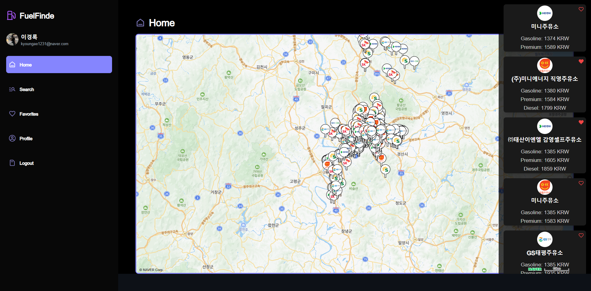

#FuelFinde

<h2> FuelFinde</h2>
대구에서 주유소를 편하게 찾을 수 있는 웹 FuelFinde입니다.  각 주유소의 가격을 비교할 필요없이 가장 싼 주유소를 미리 찾아 확인할 수 있습니다. 🍀

## 목차
  - [개요](#개요) 
  - [설명](#설명)

## 개요
- 프로젝트 이름: FuelFinde 
- 프로젝트 지속기간: 2024.01-2024.03
- 개발 엔진 및 언어: Next.js && node.js
- 멤버: 이경록

## 설명
|||
|:---:|:---:|
|로그인 화면|메인 화면|

주유소의 가격 및 위치를 간편하게 찾고, 운전자의 편의성을 제공하고자 FuelFinde를 개발했습니다. 
- 로그인 화면  
사용자는 일반 로그인, 카카오 로그인으로 접속하며 유저는 세션으로 관리됩니다.

- 메인화면 
왼쪽은 로그인한 사용자의 프로필이 나오고, 중앙은 마커로 주유소의 위치가 나오며 오른쪽은 대구에서 가장 싼 주유소가 나옵니다. 해당 주유소의 기준은 휘발유입니다.

|||
|:---:|:---:|
|관심 주유소 등록|검색 화면|

- 관심 주유소 등록 
비어있는 하트를 클릭하거나, 지도의 마커를 클릭 후에 관심 주유소 등록을 하면 즐겨찾기에 추가됩니다.

- 검색 화면  
검색은 Onchange로 구현했으며, 실시간으로 DB에서 데이터를 받아옵니다. 검색은 주소값으로 합니다.

|||
|:---:|:---:|
|관심 주유소 화면|프로필 화면|

- 관심 주유소 화면 
즐겨찾기에 추가된 목록들입니다.

- 프로필 화면  
여기서 닉네임을 수정합니다.

||
|:---:|
|로그아웃|
- 로그아웃  
로그아웃 버튼을 누를시, 카카오 로그인일경우 카카오측과 연결을 끊은 후에 세션을 파괴하고,
일반 로그인일경우 세션만 파괴한 이후 로그인 화면으로 돌아갑니다.

