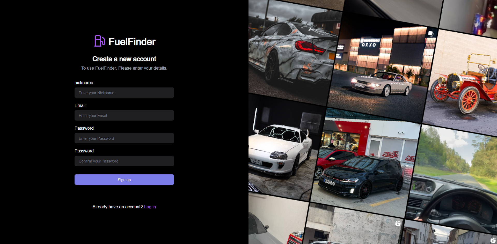
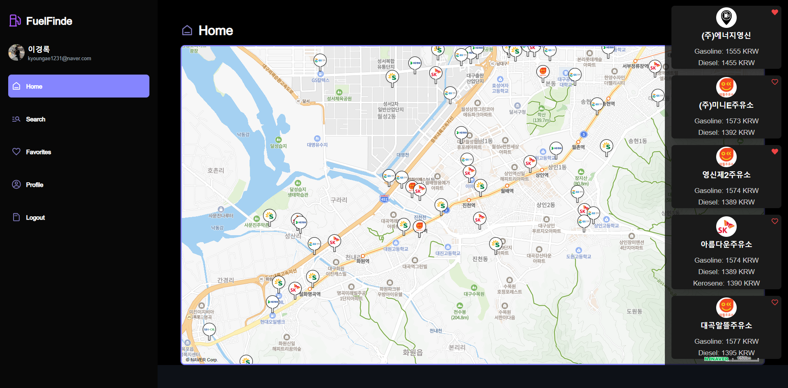

  <h1>FuelFinde</h1>
  
대구에서 가장 저렴한 주유소를 쉽게 찾아주는 웹 애플리케이션, FuelFinde입니다. 여러 주유소의 가격을 일일이 비교할 필요 없이, 가장 저렴한 주유소를 빠르게 확인할 수 있습니다. 🍀

## 목차
  - [개요](#개요)
  - [설명](#설명)

## 개요
- **프로젝트 이름:** FuelFinde 
- **프로젝트 기간:** 2024년 1월 - 2024년 3월
- **사용 기술:** Next.js, Node.js
- **팀원:** 이경록

## 설명
다음 이미지들은 FuelFinde의 주요 화면을 보여줍니다:
| 회원가입 화면 |
|:---:|
||
|사용자가 일반 화원가입을 할 때 사용하는 페이지 입니다.|

| 로그인 화면 | 메인 화면 |
|:---:|:---:|
|||
|사용자는 일반 로그인 또는 카카오 로그인을 통해 액세스할 수 있습니다.|로그인한 사용자의 프로필이 왼쪽에, 중앙에는 주유소 위치를 나타내는 마커가, 오른쪽에는 대구에서 가장 저렴한 주유소가 표시됩니다.|

| 관심 주유소 등록 | 검색 화면 |
|:---:|:---:|
|||
|하트 아이콘을 클릭하거나 마커를 선택하여 주유소를 즐겨찾기에 추가할 수 있습니다.|실시간으로 데이터베이스에서 정보를 받아오며, 검색은 주소를 기준으로 이루어집니다.|

| 관심 주유소 화면 | 프로필 화면 |
|:---:|:---:|
|||
|사용자의 즐겨찾기에 추가된 주유소 목록입니다.|사용자는 여기에서 자신의 닉네임을 수정할 수 있습니다.|

### 로그아웃
| 로그아웃 화면 |
|:---:|
||
|카카오 로그인을 사용한 경우, 카카오와의 연결을 끊고 세션을 파괴합니다. 일반 로그인의 경우, 세션을 파괴한 후 로그인 화면으로 돌아갑니다.|